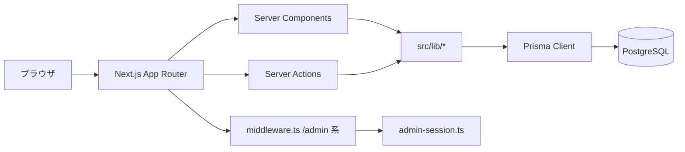

# CommuHub（コミュハブ）

チーム内予定表でメンバーの週間日程を把握するための Web アプリです。

## 技術スタック（概要）

- **言語**: TypeScript
- **フロント**: Next.js（App Router）、React
- **UI**: shadcn/ui（Base UI / Radix 系）、Tailwind CSS
- **DB**: PostgreSQL（開発は Docker Compose を想定）
- **ORM / マイグレーション**: Prisma

## システムアーキテクチャ

CommuHub は Next.js App Router を中心に、Server Component / Server Action / Prisma を組み合わせた構成です。  
管理画面は Cookie ベースのセッション認証で保護し、一般画面（週間予定）は同一アプリ内で公開しています。




### レイヤー別の役割

- **UI / ルーティング**: `src/app` と `src/components` が画面描画・操作を担当（App Router のレイアウト分割を活用）
- **アプリケーションロジック**: `src/app/**/actions.ts` の Server Action が入力検証・更新処理・再検証を担当
- **ドメイン / 共通処理**: `src/lib` に認証、ICS 取り込み、表示名、外部リンクなどの再利用ロジックを集約
- **データアクセス**: `src/lib/prisma.ts` の Prisma Client 経由で `prisma/schema.prisma` のモデルを永続化
- **認証保護**: `src/middleware.ts` と `src/lib/admin-session.ts` で `/admin` 配下のアクセス制御とセッション検証を実施

### データ・認証フロー（概要）

1. ユーザーがページへアクセスすると、App Router が Server Component を描画
2. 管理画面では middleware が現在パスを引き渡し、未認証時は `/admin/login` にリダイレクト
3. ログイン成功時に署名付き Cookie を発行し、以後の管理操作を許可
4. 更新系操作は Server Action から Prisma を通して DB へ反映し、`revalidatePath` で画面を再検証

## フォルダ構成（主要ディレクトリ）

```text
commuHub/
├─ src/
│  ├─ app/                         # App Router エントリ（ページ、レイアウト、Server Actions）
│  │  ├─ (main)/                   # 一般画面（トップ、weeklyAgenda）
│  │  └─ admin/                    # 管理画面（login / protected）
│  ├─ components/                  # 画面用コンポーネント（weekly-schedule, site-header, ui など）
│  ├─ lib/                         # 共通ロジック（認証、Prisma、ICS、表示名、ルーティング）
│  ├─ generated/prisma/            # Prisma 生成クライアント
│  └─ middleware.ts                # /admin 配下のリクエスト前処理
├─ prisma/
│  ├─ schema.prisma                # DB スキーマ定義
│  └─ migrations/                  # マイグレーション履歴
├─ scripts/                        # 開発・ビルド補助スクリプト（demo, electron, asset copy）
├─ electron/                       # Electron ラッパー（デスクトップ配布向け）
├─ deploy/iis/                     # IIS 配備用設定
├─ public/                         # 静的アセット
├─ docker-compose.yml              # 開発用 PostgreSQL 起動設定
└─ README.md
```

> 補足: ローカル開発時に生成される `.next/` はビルド生成物であり、アプリ本体のソース構成には含みません。

## ランタイム

`package.json` の `engines` に合わせて Node.js / npm を揃えてください。`.nvmrc` に推奨の Node バージョンを記載しています。

## 開発の始め方

1. 依存関係のインストール
  ```bash
   npm install
  ```
2. 環境変数（`.env.example` を複製して `.env` を用意する）
  PowerShell の例: `Copy-Item .env.example .env`  
   bash の例: `cp .env.example .env`
   **必須**: `ADMIN_PASSWORD`（部署・メンバー管理のログイン用）と `ADMIN_SESSION_SECRET`（Cookie 署名用。十分に長いランダム文字列）を本番相当の値に変更してください（NFR-SEC-01）。
   画面上の製品名は **{表示名} CommuHub** の形で、末尾の `CommuHub` は固定です。表示名の既定は **PonzRyu**（全体では「PonzRyu CommuHub」）。ログイン後の **管理** 画面（`/admin`）の「アプリ表示名」で表示名を変更できます。
3. PostgreSQL の起動（Docker が使える環境）
  ```bash
   docker compose up -d
  ```
4. データベースマイグレーション（初回・スキーマ変更時）
  ```bash
   npm run db:migrate
  ```
5. 開発サーバー
  ```bash
   npm run dev
  ```

ブラウザで [http://localhost:3000](http://localhost:3000) を開きます。管理者パスワードでログインしたうえで、[http://localhost:3000/admin](http://localhost:3000/admin) の管理メニューから部署・メンバーを操作できます。

本番向けのフロント配信・API 配置の手順は、運用方針が固まり次第この README に追記します（要件 NFR-OPS-01）。DB は CI・本番では `npx prisma migrate deploy` でマイグレーションを適用できます（NFR-OPS-02）。

## よく使う npm スクリプト


| スクリプト                | 説明                         |
| -------------------- | -------------------------- |
| `npm run dev`        | 開発サーバー                     |
| `npm run dev:demo`   | 開発サーバー（個人情報ぼかしモード）         |
| `npm run build`      | 本番ビルド（Prisma Client 生成を含む） |
| `npm run lint`       | ESLint                     |
| `npm run db:migrate` | Prisma マイグレーション（開発）        |
| `npm run db:studio`  | Prisma Studio              |


